# AI 사업계획서 관리자 매뉴얼

본 매뉴얼은 AI 사업계획서 플랫폼의 관리자 페이지 사용 방법을 안내합니다.

## 1. 관리자 로그인

관리자 페이지에 접속하기 위해서는 로그인이 필요합니다.

- **접속 주소**: `/admin/login`
- **계정 ID**: `ljj3347@naver.com`
- **비밀번호**: `dlwndwo2`

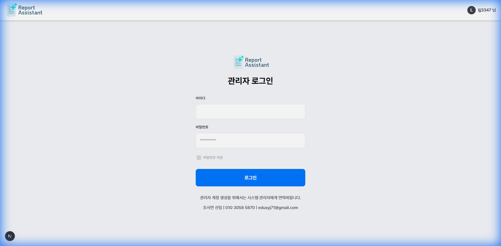

## 2. 대시보드 (Dashboard)

로그인 후 처음 접속되는 화면으로, 전체적인 현황을 파악할 수 있습니다.

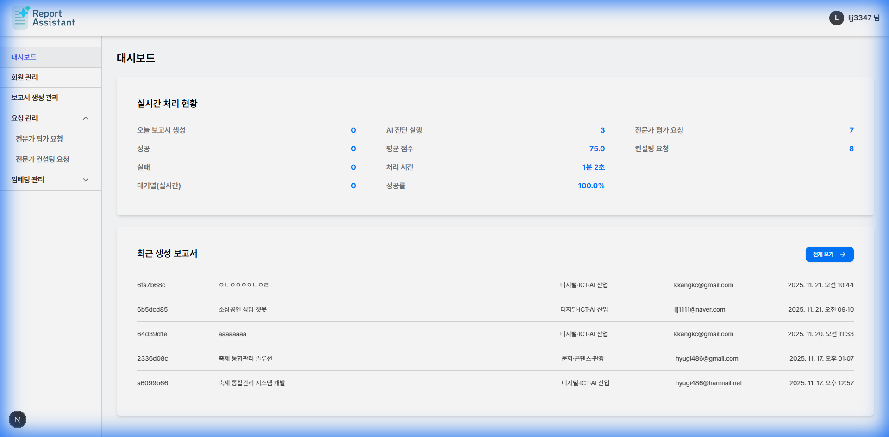

## 3. 회원 관리 (Members)

가입된 회원들의 목록을 조회하고 관리할 수 있는 페이지입니다.

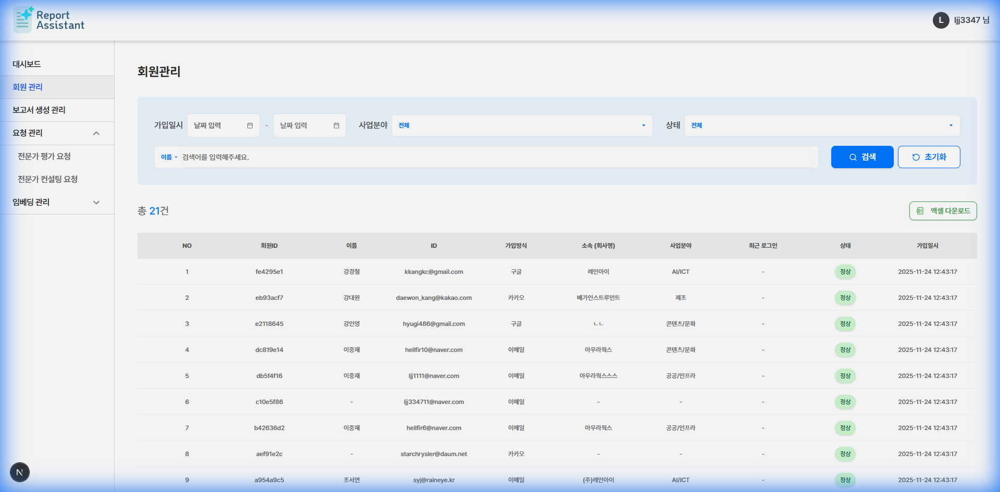

## 4. 보고서 생성 관리 (Reports)

사용자들이 생성한 AI 사업계획서 보고서 목록을 확인하고 관리합니다.

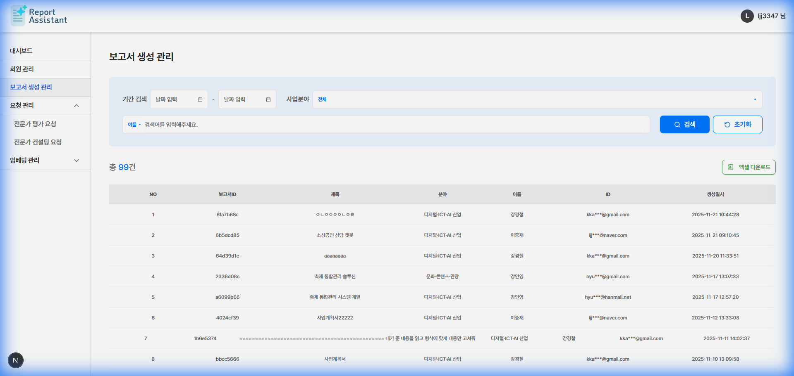

## 5. 요청 관리 (Requests)

전문가에게 요청된 평가 및 컨설팅 내역을 관리합니다.

### 5.1 전문가 평가 요청

전문가 평가 요청 목록을 확인합니다.

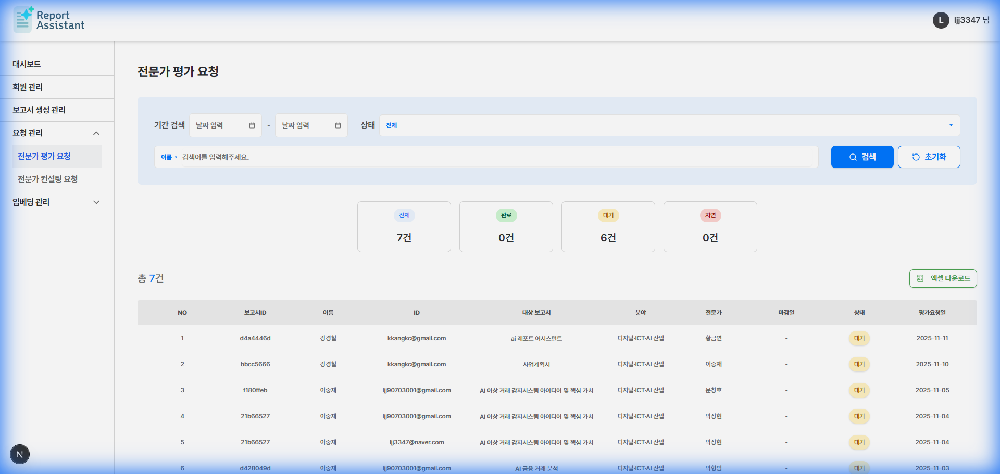

리스트의 항목을 클릭하여 상세 내용을 확인할 수 있습니다.

### 5.2 전문가 컨설팅 요청

전문가 컨설팅 요청 목록을 확인합니다.

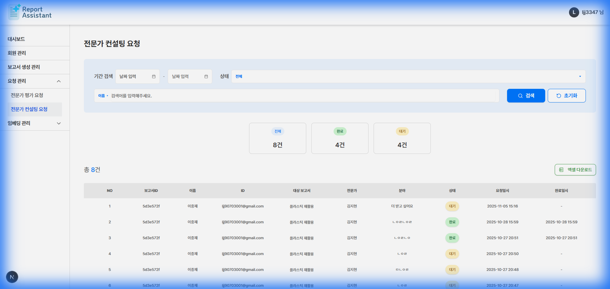

리스트의 항목을 클릭하여 상세 내용을 확인할 수 있습니다.

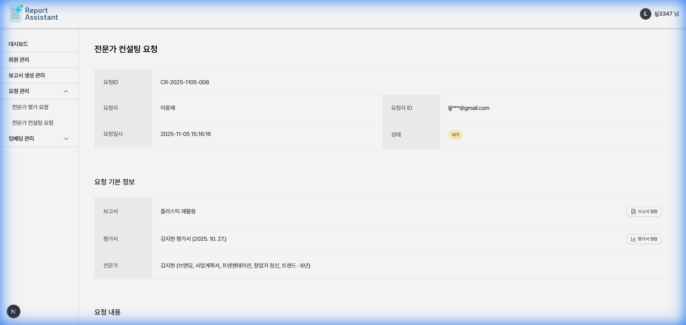

## 6. 임베딩 관리 (Embeddings)

RAG(Retrieval-Augmented Generation)를 위한 데이터 임베딩을 관리합니다.

### 6.1 보고서 임베딩

참조할 보고서 데이터를 관리합니다.

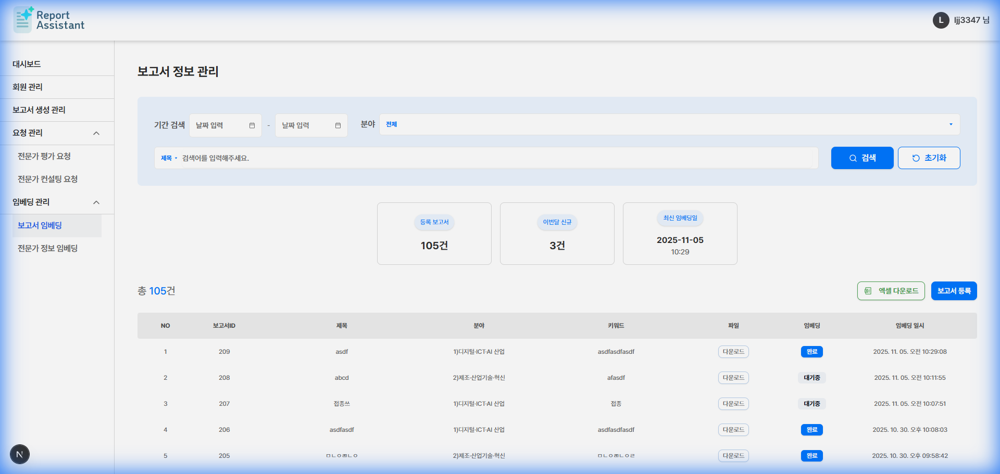

'보고서 등록' 버튼을 통해 새로운 보고서 데이터를 등록하거나 수정할 수 있습니다.

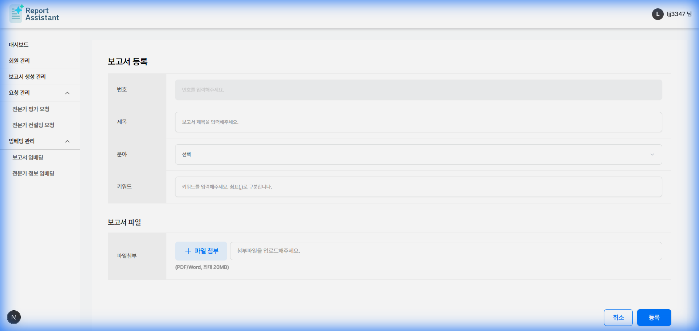

### 6.2 전문가 정보 임베딩

전문가 매칭을 위한 전문가 정보를 관리합니다.

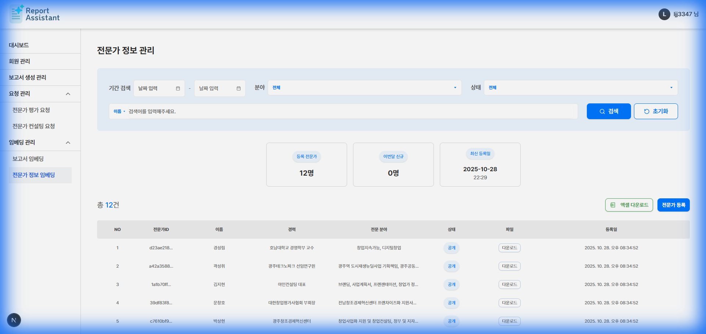

'전문가 등록' 버튼을 통해 새로운 전문가 정보를 등록하거나 수정할 수 있습니다.

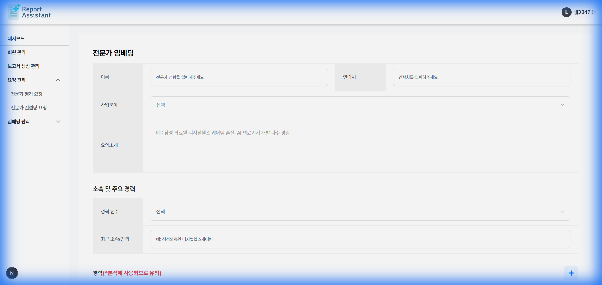
